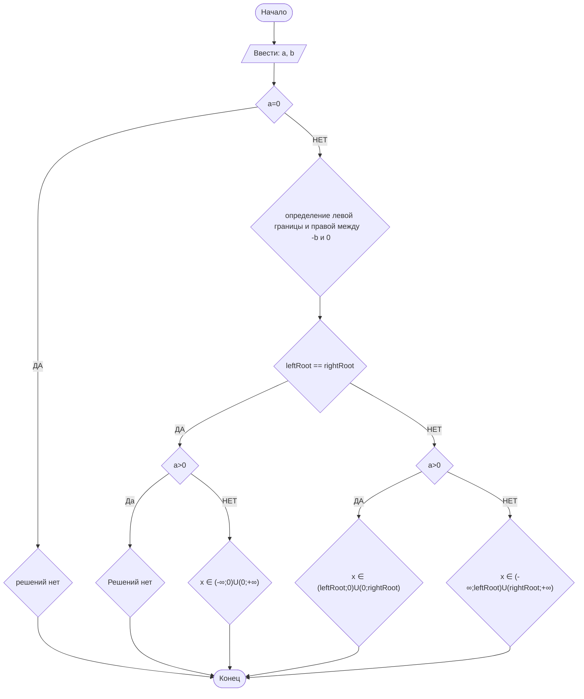

# Laba_n1_SMAGIN_PM-2601
## Отчет по лабораторной работе № 1

#### № группы: `ПМ-2601`

#### Выполнил: `Смагин Иван Федорович`

#### Вариант: `21`

### Cодержание:
- [Постановка задачи](#1-постановка-задачи)
- [Входные и выходные данные](#2-входные-и-выходные-данные)
- [Выбор структуры данных](#3-выбор-структуры-данных)
- [Алгоритм](#4-алгоритм)
- [Программа](#5-программа)
- [Анализ правильности решения](#6-анализ-правильности-решения)


### 1. Постановка задачи

> Программа получает на вход два параметра a и b. 
> Решает его для х.

Данную задачу можно разделить на две подзадачи:
1) Получение данных с клавиатуры
2) Анализ параметров и вывод правильного ответа

### 2. Входные и выходные данные

#### Данные на вход

На вход программа должна получать 2 числа, при этом в условии не сказано, к какому типу данных принадлежат получаемые числа, поэтому будем считать их вещественными типа(double). Органичение:

#### Данные на выход

Программа должна вывести множество значений х, при котором неравенство выполняется (реализуется через System.out.ptintf).

### 3. Выбор структуры данных

Программа получает 2 вещественных числа. Для их хранения
можно выделить 2 переменных (`a` и `b`) типа `double`.

|                | название переменной | Тип (в Java) | 
|----------------|---------------------|--------------|
| a (параметр 1) | `a`                 | `double`     |
| b (параметр 2) | `b`                 | `double`     | 

### 4. Алгоритм

#### Алгоритм выполнения программы:

1. **Ввод данных:**  
   Программа считывает два вещественных числа, обозначенные как `a` и `b`.
   
2. **Анализ данных:**
   1)Программа сравнивает параметр а с нулем, если а=0, то решений нет, т.к. левая часть неравенства строго меньше нуля.
   В знаменателе неравенства квадратное уровнение, графиком которого является парабола с корнями 0 и -b (полученный от пользователя параметр).
   3)Программа сравнивает два корня, чтобы понять какой из них левый, а какой правый.
   4)Сравнивает b с нулем, далее выполняется определение границ области ответов.
4. **Вывод результата:**
   Программа выводит результат анализа данных и определения области ответов.

#### Блок-схема



### 5. Программа

```java
import java.util.Scanner;

public class MAMA {

    public static void main(String[] args) {
        Scanner scanner = new Scanner(System.in);

        // 1. Ввод данных
        System.out.println("Введите параметр a:");
        double a = scanner.nextDouble();

        System.out.println("Введите параметр b:");
        double b = scanner.nextDouble();

        System.out.println("\n--- Решение ---");

        // Логика решения
        
        // a == 0 если true то решений нет
        if (a == 0) {
            System.out.println("Решений нет (так как 0 < 0 неверно).");
            return;
        }

        // Если a != 0, анализируем знак 'a' и 'b'
        // Нам нужно найти интервалы, где x*(x+b) имеет нужный знак.
        // Корни знаменателя: x1 = 0, x2 = -b.
        
        // Для удобства определим "левый" и "правый" корни
        double root1 = 0;
        double root2 = -b;
        double leftRoot;
        Double rightRoot;
        if (root1>root2){
            rightRoot = root1;
            leftRoot = root2;
        }
        else{
            rightRoot = root2;
            leftRoot = root1;
        }

        // Если корни совпадают (b == 0)
        if (leftRoot == rightRoot) {
            // b == 0, значит знаменатель x^2
            // Если a > 0: x^2 всегда > 0 => нет решений
            // Если a < 0: a / x^2 всегда < 0, кроме x = 0
            if (a > 0) {
                System.out.println("Решений нет.");
            } else {
                System.out.println("x с (-бесконечность; 0) U (0; +бесконечность)");
            }
            return;
        }

        // Если корни разные (b != 0)
        // Выражение x*(x+b) положительно на интервалах (-∞; leftRoot) и (rightRoot; +∞)
        // Выражение x*(x+b) отрицательно на интервале (leftRoot; rightRoot)

        if (a > 0) {
            // a > 0, значит дробь < 0, когда знаменатель < 0
            // Нам нужен интервал, где знаменатель отрицательный
            System.out.printf("x c (%.2f; %.2f)\n", leftRoot, rightRoot);
        } else {
            // a < 0, значит дробь < 0, когда знаменатель > 0
            // Нам нужны интервалы, где знаменатель положительный
            System.out.printf("x c (-бесконечность; %.2f) U (%.2f; +бесконечность)\n", leftRoot, rightRoot);
        }
    }
}

```

### 6. Анализ правильности решения

Программа работает корректно на всем множестве решений с учетом ограничений.

1. Тест на `a=0`:
- **Input**:
        ```
        0 78,1
        ```

- **Output**:
        ```
        Решений нет (так как 0 < 0 неверно).
        ```

2. Тест на `a>0, b>0`:
- **Input**:
        ```
        5 1,3
        ```

- **Output**:
        ```
        x c (-1,30; 0,00)
        ```
  
3. Тест на `a>0, b<0`:
- **Input**:
        ```
        1000 -245,1
        ```

- **Output**:
        ```
        x c (0,00; 245,10)
        ```

4. Тест на `a<0, b<0`:
- **Input**:
        ```
        -1000 -245,1
        ```

- **Output**:
        ```
        x c (-бесконечность; 0,00) U (245,10; +бесконечность)
        ```

5. Тест на `a<0, b>0`:
- **Input**:
        ```
        -10,6 21,712
        ```

- **Output**:
        ```
        x c (-бесконечность; -21,71) U (0,00; +бесконечность)
        ```
